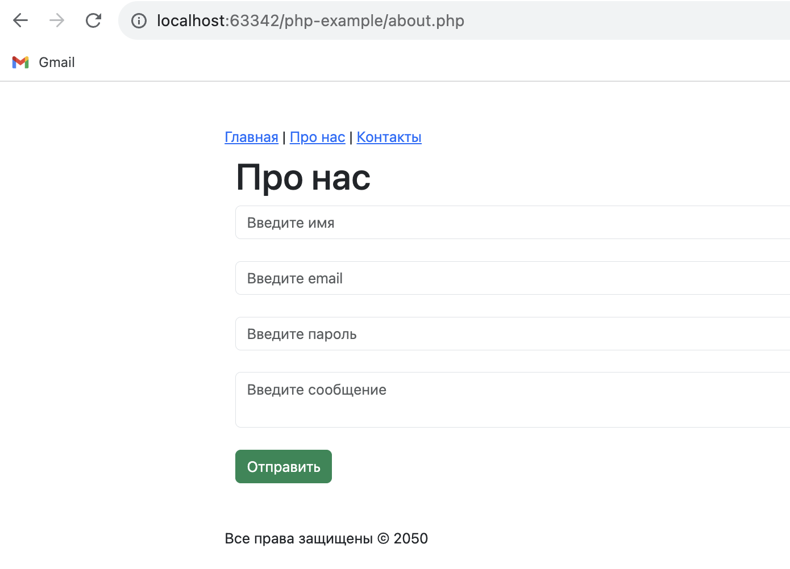
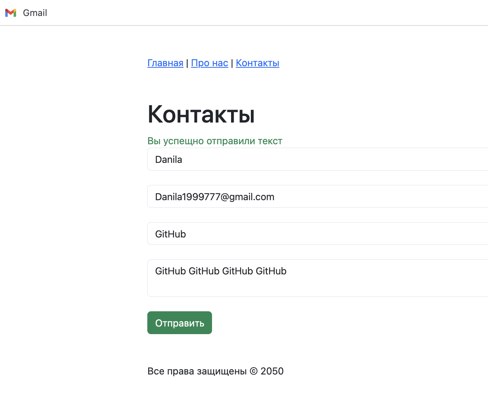

  
  
  

# PHP Training Plan
- [x] Maintenance in PHP
- [x] Local server
- [x] Variables and data types and functions
- [x] Mathematical operations
- [x] Conditional statements
- [x] Switch-case operator
- [x] Data sets. One-dimensional and multidimensional
- [x] Loop for, while and do while. Loop Operators
- [x] Functions
- [x] Connecting files
- [x] Form processing. Transferring data using POST and GET methods
